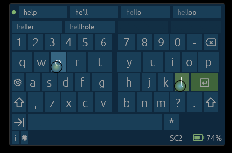

# KOSK

[Download and start](#download-and-start) · [Controls](#controls) · [Steam setup](#steam-desktop-configuration) · [Customization](#advanced-customization)

An on-screen keyboard primarily designed for the Steam Controller.

I have an OG Steam Controller and remember the original OSK that Steam shipped for it. In anticipation of SC2's pending release, I wanted to see how desktop navigation using Steam and a controller holds up today. I tried with a GameSir Cyclone 2 I own (want to preserve my OG SC), and the experience was not great, especially the OSK. I sorely missed the original OSK, so I decided to make my own one. I have since gotten my own SC2, and have been exclusively using this OSK. See below for my hacky way of using it together with Steam, effectively replacing the built-in OSK.

I built KOSK for my own use and am sharing it under the MIT license. You're welcome to use and modify it, but I can't promise support, replies to issues, or new features.

## Download and start

1. Download the Windows x64 ZIP from this repository's **Releases** section.
2. Extract the whole ZIP into a folder.
3. Connect your controller and open `kosk.exe`.
4. Press **Ctrl+Alt+F10** to show KOSK, or click the blue **K** in the Windows notification area.

KOSK starts hidden. Use the shortcut or tray icon to show/hide it, and the tray menu to quit. You can [change the shortcut](docs/show-hide.md).

There's nothing else to install or download, and KOSK doesn't need administrator rights. The included layouts, mappings, themes, and English word suggestions work offline.

The alpha is **unsigned**, so Windows may warn about it or block it from running. Only use the ZIP from this repository's Releases section. Don't disable Windows protection to run it.

## Requirements

- **Windows 11 x64.**
- **Steam Controller 2** or **DualShock 4**; check the release notes for tested models and connections.
- Windows only for now. I'd like to support Linux later.



## Controls

Default controls; A/B/X/Y on the Steam Controller correspond to Cross/Circle/Square/Triangle on DualShock 4.

- **Pads or sticks:** move the left and right key selections.
- **Left/right trigger:** enter the selected key on that side, or accept a highlighted word suggestion.
- **Pad click:** enter the key selected by that pad.
- **A / Cross:** Enter, or accept a highlighted suggestion.
- **X / Square:** Backspace. **R5:** Space.
- **Y / Triangle** or **L4:** toggle Shift. **Left/right stick click:** toggle Ctrl/Alt.
- **D-pad:** arrow keys.
- **Left/right bumper:** select the previous/next word suggestion. **B / Circle:** clear the suggestion selection.
- **Hold the left button beside Steam, then press Y:** open settings. On DualShock 4, hold Share and press Triangle.
- **Hold that same left button, then press B:** open text-input mode. On DualShock 4, hold Share and press Circle.
- **Quick Access (⋯):** open the mappings editor.

Normal typing sends each key straight to your application. In text-input mode, you compose a line inside KOSK first. Submitting sends the line followed by Enter, then returns to the keyboard.

## Word suggestions

Suggestions can finish a word, correct a typo, or offer the next word. English suggestions are included and need no setup.

Press **L5** just after accepting a suggestion to delete one character and offer your original text as the first suggestion. Select it to restore that text.

Hold the left button beside Steam and press X to turn suggestions on or off; on DualShock 4, hold Share and press Square. Change their appearance and behavior in **Settings → Options → Suggestions**. You can also choose whether KOSK remembers picked words and submitted lines. That memory stays on your computer under `%LOCALAPPDATA%\kosk`.

Suggestions follow what you type through KOSK; they don't read text from your application. Moving the cursor or pasting can pause them because KOSK loses track of the text.

## Settings and appearance

Open settings to adjust controller feel, key and text size, and key repeat, or change themes, layouts, and button mappings.

KOSK saves your changes in `%LOCALAPPDATA%\kosk\config.toml`. To open it in your editor, go to **Settings → Options** and press **Share** (the left button beside Steam). The file only needs settings you've changed.

## Steam desktop configuration

This is how I use KOSK alongside Steam's desktop controls: one button shows KOSK and switches Steam to an action layer with its desktop bindings cleared. The same button hides KOSK and switches back.

Choose a shortcut and use the same one in KOSK and Steam. F3 below is just an example.

1. Open `%LOCALAPPDATA%\kosk\config.toml`, or go to **Settings → Options** and press **Share**. Set your shortcut at the top, before any `[section]` headings:

   ```toml
   show_hide_shortcut = "F3"
   ```

2. In Steam's desktop configuration, bind a button (for example, **R4**) to send your shortcut and enter a dedicated KOSK action layer.
3. In that layer, remove all inherited desktop actions. Bind only that button: send the same shortcut and leave the layer.
4. Leave that button unbound in KOSK.

Leave KOSK running and use that button to switch between it and Steam's desktop controls.

Don't also bind that button inside KOSK: one press could show it and immediately hide it again. The tray and other shortcuts don't switch Steam's layer, so using them can leave the two out of sync.

## Advanced customization

Layouts, themes, and mappings are TOML files. Keep your copies separate from the bundled files so updates don't overwrite them. Relative paths start beside `%LOCALAPPDATA%\kosk\config.toml`; image paths in themes start beside the theme file. Put top-level settings such as `themes` and `controller_map` before any `[section]` headings.

### Create a layout

Start with a copy of [the main layout](old_sc.toml) or [the symbols layout](old_sc_symbols.toml), saved as `%LOCALAPPDATA%\kosk\layouts\mine.toml`. Add it to `%LOCALAPPDATA%\kosk\config.toml`:

```toml
[layouts]
mine = "layouts/mine.toml"
```

Select it in **Settings → Layouts**. Don't remove the `main` layout entry.

Edit the rows and keys to suit your layout. You can change their widths and labels, the area each pad or stick can reach, and where its selection rests. Keys can type characters or whole strings, send keys such as Backspace, or run actions. These two entries inside a row add a number key and a switch back to the main layout:

```toml
[[rows.items]]
key = { normal = "1", shift = "!" }
width = 1.2

[[rows.items]]
key = "switchLayout.main"
display = "Letters"
```

`display` sets the label without changing what the key does. You can also use conditions to change labels or colours when Shift is on or a suggestion is selected. The [layout reference](docs/developer/keyboard-layout.md) explains the remaining fields.

### Create a theme

Save a theme as `%LOCALAPPDATA%\kosk\themes\amber.toml`, for example:

```toml
name = "Amber"
background_color = [24, 20, 16, 255]
keyboard_opacity = 0.8
ui_opacity = 1.0

[keyboard]
left_selection_color = [175, 100, 30, 255]
right_selection_color = [100, 130, 45, 255]
dual_selection_color = [150, 85, 110, 255]
```

Add your custom theme files to the top-level `themes` list in `%LOCALAPPDATA%\kosk\config.toml`:

```toml
themes = ["themes/*.toml"]
```

Select it in **Settings → Themes**. Anything you leave out uses the built-in appearance. Colours can be RGB, RGBA, or names you've defined in a `[colours]` palette. The [theme guide](docs/themes.md) covers the other options, including background images.

### Add bindings and conditions

Use **Settings → Mappings**, or create `%LOCALAPPDATA%\kosk\mappings.toml` and set this top-level option in `%LOCALAPPDATA%\kosk\config.toml`:

```toml
controller_map = "mappings.toml"
```

Only write the bindings you want to change. Put them under the screen where they apply, such as `[Keyboard]` or `[TextInput]`. Set a binding to `"none"` to remove a default.

For example, make the right trigger accept a highlighted suggestion, or type the selected right-hand key if none is highlighted:

```toml
[Keyboard]
triggerRight = [
    { action = "acceptSuggestion", when = "suggestionSelected" },
    { action = "sendKeyUnderRightStick" },
]
r4 = "none"
```

KOSK uses the first rule whose `when` condition is true. Put the default action last, without a `when` clause. If nothing matches, the button does nothing.

Combine conditions with `&&` (and), `||` (or), `!` (not), and parentheses. For example, `"completionActive && !modifier.ctrl"` means suggestions are on and Ctrl is off.

For a chord, join two button names with `+`: hold the first, then press the second. The first button can't also have its own binding on that screen.

The [binding reference](MAPPINGS.md) lists the button names, actions, screens, and `when` conditions.

## Updates and removal

To update, quit KOSK, extract the new release into a new folder, and run its `kosk.exe`. Your settings, custom files, and learned words stay in `%LOCALAPPDATA%\kosk`.

To remove it, quit and delete the application folder. Delete `%LOCALAPPDATA%\kosk` too if you want to remove your settings, custom files, and learned words.

## AI development disclaimer

I used AI to write KOSK. I've made every effort to understand the code rather than leave it as a black box, and I maintain [developer documentation](docs/developer/README.md) explaining its architecture. There will still be bugs.

## License and credits

KOSK code is [MIT licensed](LICENSE). Bundled [English completion data](data/completion/en/README.md) and [controller glyphs](assets/controller-glyphs/README.md) have separate terms and credits.
