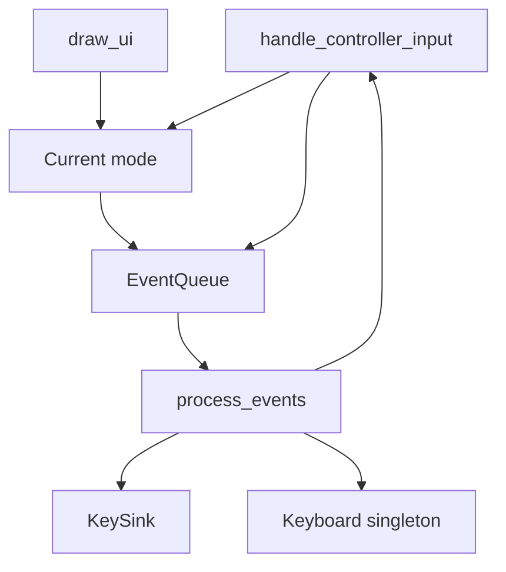

# Application state (`state/mod.rs`)

This document describes `AppState` in `src/state/mod.rs`: the mode enum, the shared event queue, and the two entry points that the UI thread and the controller thread call. Individual modes have their own pages. The queue’s debounce rules are in [event-debounce.md](event-debounce.md).

## What this object is

`AppState` is the process’s session. It knows which mode is visible (`StateId`), where the overlay sits (`WindowPos` plus an optional pointer snapshot), how large the monitor is, the `EventQueue` that all modes write into, and the `KeySink` that actually types.

It does not own the mode structs. Those live in seven process-wide `OnceLock<Mutex<…>>` cells initialized from `AppState::new`: keyboard, menu (the settings screen), move-window, text-input, select-layout, select-key, and mappings. `keyboard::with_mut` (and the equivalents) lock one mode at a time. That is a leftover of each mode being a singleton that reloads itself on config change. `AppState` still coordinates them: it chooses which one handles a poll, and it is the only place that drains the event queue into side effects.

## Modes

`StateId` is `Keyboard`, `Settings`, `MoveWindow`, `TextInput`, `Mappings`, `SelectKey`, or `SelectLayout`. The process starts in `Keyboard`. Modes switch by enqueueing `Event::ChangeState`. `process_events` assigns `self.state`. There is no stack: opening settings replaces keyboard, and “Back” is just a change to `Keyboard` or `Settings` depending on the button.

Sub-UI calls are the exception to that flat switching. A mode can enqueue `Event::CallState` to push the current mode onto a call stack and open a helper on top of it; today the only call is the mappings editor opening the key picker (`Mappings` calls `SelectKey`). The helper answers with `Event::ReturnState`, which pops the stack, returns to the caller, and delivers the result — the key picker hands the chosen binding back to the mappings editor's `on_return`. A `ReturnState` with an empty stack is ignored. `Event::Repaint` requests a frame without changing modes, for in-place UI updates such as the mappings draft changing under the user's hands.

Each mode both draws and handles controller input. Mouse clicks are handled inside `draw_ui` because that is where egui button responses exist. Controller input is handled on the HID thread.

## The two ticks

`draw_ui` (UI thread) refreshes debounce intervals from config, draws the current mode, then calls `process_events`. Keyboard drawing may push `MouseClick` events (a click on a key). Move-window drawing may enqueue save or cancel. Analog placement updates `AppState.pos` on the HID tick, not from the draw path.

`handle_controller_input` (HID thread) also refreshes debounce intervals, optionally copies the snapshot into the debug plugin, dispatches to the current mode, then **always** calls `events.end_controller_tick()` before `process_events`. That end-of-tick call is what the queue uses to notice button releases. Skipping it would break repeat-vs-tap. Text-input mode has its own nested queue and calls `end_controller_tick` on that nested queue internally; the outer queue still gets an end-of-tick from `AppState` for events the nested path forwarded.

## `process_events`

This match is the side-effect boundary. Handlers are supposed to enqueue, not type.

- `SendKey` / `SendText` go to the key sink. Errors print and do not panic.
- `ChangeState` writes `self.state`. Leaving Move Window without `SaveWindowPos` restores the position captured on entry. Entering Mappings starts a fresh editor session, entering SelectLayout refreshes the layout list, and entering MoveWindow snapshots the position; switching state also clears the call stack.
- `CallState` pushes the current mode onto the call stack, switches to the callee, and initializes it with the request (today only the key picker, prefilled with the binding being edited). The newly shown mode resets its controller edge state against the held buttons so a still-held button does not fire on entry.
- `ReturnState` pops the call stack back to the caller and delivers the result. The mappings editor applies an accepted binding to its draft or discards a cancellation. Follow-up events the caller enqueues while handling the result (such as a repaint) are merged directly into the pending list, bypassing debounce, because they are programmatic rather than held buttons.
- `Repaint` only asks egui for another frame.
- `SaveWindowPos` writes `window_pos` through `config::save` (see [config.md](config.md)) and clears the move-window origin so the following `ChangeState` does not restore it.
- `FlipWindowLeftRight`, `FlipWindowAboveBelow`, and `RotateWindow` only affect a `MousePointer` placement; they are no-ops for corner or absolute positions. See [window-position.md](window-position.md).
- `Exit` sends `ViewportCommand::Close`.
- `ToggleRecord` starts or stops a `.krec` capture.
- `ToggleShift` / `ToggleCtrl` / `ToggleAlt` call into `KeyboardState`. They used to run inside `do_action` and flickered; they are events so the queue can suppress repeats.

## Construction and replay

`AppState::new` reads config, initializes the seven mode singletons and the completion session, creates an `EventQueue`, and opens the key sink. Monitor size is stored so position clamping has a rectangle to work with; `set_monitor_size` updates it every frame from egui.

`apply_replay_header` is called once when the controller thread opens a replay device, before snapshots flow. It overlays recorded config and replaces keyboard layouts with the copies from the tape.

## What this does not cover

**How a letter becomes `SendText` lives in the keyboard.** This file only drains whatever was accepted.

**How `WindowPos` becomes pixels lives in `window_pos.rs`.** `get_position` is the AppState wrapper that snapshots the pointer once and persists clamped absolute coordinates.

## Summary

`AppState` is a thin coordinator: it picks a mode, gives that mode the shared event queue, ends the controller tick, and turns accepted events into typing, mode changes, window moves, and recording. The interesting policy for each of those effects lives in the mode modules, the event queue, the key sink, and window positioning — not in this file’s match arms, which are deliberately boring.
