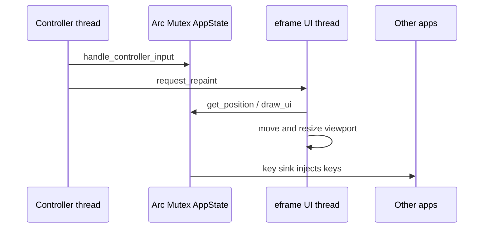

# Process overview (`main.rs`, `lib.rs`)

This document describes how the KOSK process starts, how the overlay window is created, and how the user-interface thread and the controller thread share one `AppState`. The crate root is `src/lib.rs`. The GUI binary is `src/main.rs`. Auxiliary binaries — `completion_dev` and `completion_build` for prediction work, `sc2_test` for HID checks, and `glyph_gallery` for button art — link the same library.

## What the program is

KOSK is a small always-on-top window that draws an on-screen keyboard (and a few other modes) and injects keystrokes into whichever application currently has focus. The overlay itself is configured not to become the active window, so clicking a key or holding a trigger should type into a text field in another program rather than into KOSK.

That split — “we draw here, we type elsewhere” — is the reason the window setup in `main.rs` looks unusual, and it is why outgoing typing goes through a [key sink](key-sink.md) instead of an ordinary text widget.

## Crate surface

`src/lib.rs` only declares modules:

- `completion` — word/next-token prediction for Keyboard and TextInput (worker + chips). Also `completion_dev` / `completion_build`.
- `config` — TOML load, watch, and save.
- `controller` — HID devices, bindings, recording.
- `state` — `AppState` and every on-screen mode.

The GUI binary is the default run target (`default-run = "kosk"` in `Cargo.toml`). Tests and the other binaries import `kosk::…` rather than reaching into `main.rs`.

## Startup

`main` begins by calling `config::init()`. That parses command-line arguments (the config path is required; `--replay`, `--keys-log`, and `--ignore-recorded-config` are optional) and loads `config.toml`. After that, `eframe::run_native` creates the window.

The native options are chosen for an overlay, not a normal app window:

- The viewport is transparent if `transparent = true` in config.
- `with_active(false)` asks not to take focus when the window appears.
- `with_always_on_top()` keeps the keyboard visible over other windows.
- Decorations are off and the window is not user-resizable. Size is driven by layout instead.
- An initial inner size is given only as a placeholder. After the first frames, `App::update` measures the keyboard and sends `ViewportCommand::InnerSize`.

Both renderers are built in. Set `renderer = "glow"` (default) or `renderer = "wgpu"` in config, or choose Renderer under Options → Overlay. Changes require a restart; config reloads and menu edits leave the running renderer unchanged.

Inside the eframe creation closure, KOSK builds `AppState` with the current monitor size, wraps it in `Arc<Mutex<AppState>>`, registers a config-change callback that requests a repaint, and spawns the controller thread. The UI object (`App`) holds the same `Arc`.

## Two threads

The **controller thread** loops on `controller::find_device()`. When no device is present it sleeps 500 ms and tries again, unless the preferred controller is replay, in which case a missing tape closes the window. When a device is open, each poll:

1. Optionally taps the recording session (`record::session().tap_input`).
2. Locks `AppState` and calls `handle_controller_input`.
3. Calls `ctx.request_repaint()` so the UI thread will redraw with the new highlight.

If the device is a replay tape, the thread closes the window when the tape ends.

The **UI thread** runs `App::update` on every egui frame. It applies visuals, keeps the Win32 extended style bits set, asks `AppState` for a window position, draws the current mode, and resizes the viewport if the measured content size changed.

Those two threads share one mutex. A controller poll and a paint cannot mutate `AppState` at the same time. That is crude, but the work on each side is short: evaluate bindings, enqueue events, drain them, draw buttons.

## The overlay window on Windows

Every frame, `App::update` uses the raw Win32 handle from eframe:

- It sets `WS_EX_NOACTIVATE` so the overlay does not steal activation. The system can clear this bit, which is why it is applied every frame rather than once at startup.
- If transparency is on, it also sets `WS_EX_LAYERED` and `SetLayeredWindowAttributes`.
- It enables DWM blur behind so semi-transparent backgrounds composite. Move Window uses an empty blur region instead so the ghost is see-through.

`clear_color` and the egui visuals follow the same config flag: an opaque theme background when `transparent` is false, theme background alpha multiplied by theme opacity when it is true. Move Window ignores theme opacity and clears to fully transparent while the window is transparent.

Fonts are configured only on Windows. Segoe UI Symbol and Segoe UI Emoji are added as proportional fallbacks so layout labels that use symbols still render.

## Window position and size

Position is not left to the OS. Each frame, `AppState::get_position` returns coordinates in egui points. `update` sends `ViewportCommand::OuterPosition` with that pair. See [window-position.md](window-position.md) for how corners, absolute coordinates, and “mouse pointer” placement are computed.

Size comes from measuring the central panel after `draw_ui`. A minimum size is recorded on the first non-zero layout and then used as a floor so the window does not shrink when a mode draws less content than the keyboard. When the measured size changes, `InnerSize` is sent.

## Typing cursors

Keyboard state retains the latest controller snapshot for stick/pad cursors. Layout geometry maps it to screen positions; the cursor renderer applies config defaults and theme overrides. Diagnostic hitboxes, bounds, and reach overlays remain under `[debug]`.

## What this does not cover

**Mode logic lives under `src/state/`.** `main.rs` does not know what a key is. It only creates the window and forwards paint and HID into `AppState`. Continue with [app-state.md](app-state.md).

**Device details live under `src/controller/`.** Discovery and the `ControllerInput` trait are in [controller.md](controller.md). HID report parsing is in [devices.md](devices.md).

**Config watching is started from `config::init`, not from `main`.** The UI thread only registers a repaint callback via `config::on_changed`. See [config.md](config.md).

## Summary

KOSK is an eframe overlay that refuses activation, stays on top, and optionally draws with DWM transparency. `main` loads config, constructs a shared `AppState`, and runs two loops: egui paints and positions the window; a background thread reads a controller (or a replay tape) and asks for repaints. Everything the user thinks of as “the keyboard” is behind that mutex, in the `state` module.
