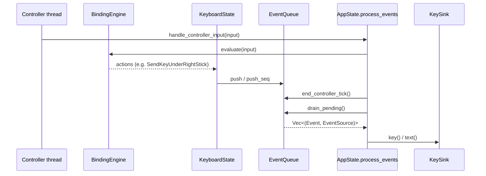

# Event queue and debouncing (`event.rs`)

This document describes how kosk turns controller and mouse input into keyboard output, and how `EventQueue` stops a held button from firing the same action on every poll.

The types and logic live in `src/state/event.rs`. Keyboard handlers enqueue work there; `AppState` drains the queue later and performs the side effects (typing, toggling Shift, changing mode, and so on).

## What problem does this solve?

Controller bindings such as `sendKeyUnderLeftStick` use **WhileHeld** trigger mode. That means the binding engine invokes the action on **every controller poll** for as long as the button is down. A typical poll rate is high enough that holding `padRight` over the letter `l` would enqueue hundreds of `SendText("l")` events per second if nothing sat in between.

`EventQueue` is that in-between layer. Action handlers still run every poll and still *ask* to send something; the queue decides whether that request is allowed through.

There are two kinds of request, and they are throttled differently:

- **Letters, keys, and chords** behave like a keyboard's auto-repeat. The first accept waits a longer gap (`event_debounce_ms`). If the same button stays held, later accepts use a shorter gap (`event_debounce_repeat_ms`).
- **Sticky modifiers** (Shift, Ctrl, Alt as on-screen toggle keys) must not auto-repeat at all. Holding a trigger over Shift should flip it once. Repeating the toggle on every poll is what used to make Shift flicker on and off.

## The main types

### `Event`

An `Event` is a side effect the app will perform later, after the queue is drained. Handlers do not type or toggle immediately; they put an `Event` on the queue and wait for `AppState::process_events`.

| Variant | Meaning |
|---------|---------|
| `SendKey(key, direction)` | Press, release, or click a virtual key via enigo |
| `SendText(String)` | Type a Unicode string |
| `ChangeState(StateId)` | Switch app mode (keyboard, menu, and so on) |
| `MoveWindow`, `FlipWindow*`, `RotateWindow`, `Exit`, `ToggleRecord` | Window and lifecycle actions |
| `ToggleShift`, `ToggleCtrl`, `ToggleAlt` | Flip the corresponding sticky modifier on the on-screen keyboard |

Sticky modifiers used to call `toggle_shift()` (and the Ctrl/Alt equivalents) directly inside `KeyboardState::do_action`. Because `do_action` runs every poll while a trigger is held, that flipped the modifier every few milliseconds. They now enqueue `ToggleShift` / `ToggleCtrl` / `ToggleAlt` instead. `process_events` is the only place that calls the actual toggle functions.

### `EventSource`

Debouncing is keyed on **who produced the event**, not on what the event says. That identity is `EventSource`.

| Variant | Example | Debounce bucket |
|---------|---------|-----------------|
| `MouseClick` | Clicking an on-screen key | One shared `"mouse"` bucket |
| `Controller(ControllerBinding)` | `padRight`, `triggerLeft`, chord bindings | One bucket per physical binding |

Each controller binding has its own timeline. Holding `padLeft` and `padRight` at the same time does not let one button borrow the other's wait. The two sources are timed independently.

### `EventQueue`

The queue keeps three pieces of state:

- **`pending`** is the list of events that have already been accepted and are waiting to be executed.
- **`last_commit`** remembers, for each `EventSource`, when that source last got through and how it should behave next (see `SourceState` below).
- **`held_this_tick`** records which controller bindings asked to commit during the current poll, including asks that were dropped. That set is how the queue notices a button going up.

## End-to-end flow



On each frame, `AppState` roughly does this:

1. **Handle input.** Controller input goes through `handle_controller_input`; mouse clicks go through `draw_ui`. In both cases the current state (usually `KeyboardState`) may call `push` or `push_seq` on the shared `EventQueue`.
2. **Notice releases.** After controller handling, `end_controller_tick` looks at which bindings asked to commit this poll. A controller source that did not ask is treated as released.
3. **Run accepted events.** `process_events` takes everything in `pending` and executes it: typing through `KeySink`, toggling sticky modifiers on the keyboard, changing mode, and so on.

Mouse clicks use the same queue. They never enter hold-repeat mode, because a click is a single edge, not a held button.

## Config

In `config.toml`:

```toml
event_debounce_ms = 200          # first accept, and gap after a release
event_debounce_repeat_ms = 55    # interval once hold-repeat is armed
```

| Setting | Default (code) | Effect |
|---------|----------------|--------|
| `event_debounce_ms` | `400` | Minimum gap before the **first** accept for a source. Set to `0` to disable all debouncing. |
| `event_debounce_repeat_ms` | `55` | Shorter gap for later accepts while the same binding stays held. Set to `0` to reuse the initial interval for every step. |

The checked-in config uses `200` / `55`, which is faster than the code defaults.

These two values only apply to letters, keys, and chords. Sticky modifier toggles ignore them; they are limited by button release (and stick selection), not by time.

## How events get into the queue

Keyboard code has two ways to submit work.

The simple way is a single call to `push`. That is what sticky modifiers do: `do_action` pushes one `ToggleShift` (or Ctrl/Alt) and is done.

The other way is `push_seq`: several leaf events that must succeed or fail together. Typing a letter while Ctrl is down is several OS actions that must not be split: press Control, click the key, release Control. `KeyboardState::send_key` collects those steps in a `Vec` and submits them once:

```rust
let mut steps = Vec::new();
steps.push(/* modifier press */);
steps.push(/* key */);
steps.push(/* modifier release */);
if events.push_seq(steps, source) {
    // clear sticky mods only if the chord was actually accepted
}
```

The queue treats that list as one debounce decision. Either every event lands in `pending`, or the whole list is dropped. `push_seq` returns `false` when the list was dropped, so keyboard code can avoid clearing modifier state for a send that never happened.

An empty list is a no-op. A list of one event is the same as `push`. Two or more events always use the timed hold-repeat rule described next. Sticky modifiers are submitted with `push` on their own, so they can use suppress-until-release instead.

Inside the queue this grouping is a private `EventGroup` (`Single` or a flat `Seq` of leaf `Event`s). It cannot nest, and `drain_pending` still returns a flat list of `(Event, EventSource)` pairs.

## Two accept rules

When it is time to decide, the queue looks at the `EventSource` and at how the work was submitted.

### Letters, keys, and chords (timed hold-repeat)

This is the auto-repeat path. It is used for every `push_seq` of two or more events, and for any `push` that is not a sticky modifier toggle.

The queue asks how long it has been since this source last got an event through:

- If this source has never been accepted, the event goes through. That is the first press.
- If hold-repeat is already armed and at least `event_debounce_repeat_ms` has passed, the event goes through (a held key repeating).
- If hold-repeat is not armed and at least `event_debounce_ms` has passed, the event goes through (a new press after a gap).
- Otherwise the event is dropped.

In code this is `hold_repeat_allows`. After an accept, `record_hold_repeat_accepted` may set `repeat_armed` so the next wait is the short interval. Arming happens only when the binding never went up since the last accept, and the gap still looks like a continuous hold (within the initial interval plus the repeat interval, minus a 40 ms fudge factor for poll jitter). Once armed, further accepts while the button stays down only need the short interval.

### Sticky modifier toggles (once per hold)

`ToggleShift`, `ToggleCtrl`, and `ToggleAlt` do not use those timers. Holding a trigger over Shift should flip it once; waiting 55 ms and flipping again would be the old flicker bug.

The first `push` of a toggle for a source is accepted. After that, the queue sets `suppress_until_release` on that source and drops every further toggle from it. Time does not matter: 50 ms or 500 ms later, still held, still dropped.

Suppression lifts in two situations:

1. **The button is released.** `end_controller_tick` sees that this binding did not ask to commit on this poll, marks it released, and clears the suppress flag. The next press is a new gesture and may toggle again.
2. **The stick moves to a different key** while the button is still down. `KeyboardState` notices the highlighted key changed and calls `clear_toggle_suppress` for that stick's sources (`triggerLeft` and `padLeft` on the left, `triggerRight` and `padRight` on the right). That is why you can hold a trigger, toggle Shift, then slide onto Ctrl and toggle Ctrl without lifting.

Stick-select lock keeps the highlighted key fixed for a short window after a letter is sent. While that lock holds, selection has not changed, so suppression stays in place.

A later letter or key on the same binding does not clear the flag. `record_hold_repeat_accepted` copies `suppress_until_release` forward, so mixing typing and toggling on one button cannot accidentally re-enable Shift flicker.

In code, a lone `push` goes through `commit_allows`, which sends toggles to `toggle_allows` / `record_toggle_accepted` and everything else to the hold-repeat functions above. A `push_seq` of two or more events always goes through `hold_repeat_allows` / `record_hold_repeat_accepted`.

The tests `toggle_hold_suppresses_repeat_until_release` and `toggle_suppress_cleared_when_selection_changes` cover the two suppress paths. Accepting a chip is an Edge `acceptSuggestion` latched for the hold in the [binding engine](bindings.md); that is why a still-held trigger does not then type a letter. `suppress_until_release` remains for toggle-style holds. `note_held` keeps the source in `held_this_tick` so release detection still works. `suppress_until_release_survives_held_ticks` and `suppress_until_release_survives_clear_toggle_suppress` cover that.

### `SourceState`

`last_commit` stores one of these per `EventSource`:

| Field | Role |
|-------|------|
| `last` | Time of the last accepted commit |
| `repeat_armed` | Next wait should use the short repeat interval |
| `released` | The binding went up since `last`, so the next accept is a new first press |
| `suppress_until_release` | Further sticky modifier toggles from this source should be dropped |
| `block_hold_until_release` | Further WhileHeld sends from this source should be dropped (completion accept) |

### How the queue notices a release

Each controller poll, WhileHeld bindings may call `push` or `push_seq`. Every such call, even a dropped one, records the source in `held_this_tick`.

After all controller handlers have run, `end_controller_tick` walks every controller source in `last_commit`. If a source is missing from `held_this_tick`, the button is treated as up: `released` is set, and `repeat_armed`, `suppress_until_release`, and `block_hold_until_release` are cleared. Then `held_this_tick` is emptied for the next poll.

That is what makes a quick tap-release-tap of `l` produce two letters instead of a first letter plus a 55 ms repeat. After the release, the next tap must wait the full initial interval again. The same pass is what lets a second tap of Shift toggle it back off. See `hello_ll_two_taps_are_two_letters`.

Mouse clicks set `released` immediately on accept. A click is not a hold, so it never arms repeat. A mouse toggle also sets `released`, so the next click is allowed through as a new gesture.

## Worked example: holding `padRight` over `l` (200 ms / 55 ms)

Assume `padRight` is bound to `sendKeyUnderRightStick` and the stick is over `l`.

| Time | Button | What the queue sees | Result |
|------|--------|---------------------|--------|
| 0 ms | down | first `push` / `push_seq` | **Accept** — `l` is typed |
| 0–199 ms | held | the same every poll | **Drop** — still inside the initial window |
| 200 ms | held | accepted; repeat arms | **Accept** — `l` |
| 255 ms | held | 55 ms later | **Accept** — `l` |
| 310 ms | held | 55 ms later | **Accept** — `l` |
| … | held | every 55 ms | repeat while held |

Release, then tap again:

| Time | Button | Result |
|------|--------|--------|
| release | up | `end_controller_tick` marks the source released and clears repeat |
| +201 ms | down | **Accept** — new first press, not a repeat |
| +256 ms | held | **Drop** — still inside the 200 ms initial window for this new press |
| +401 ms | held | **Accept** — repeat arms after this second first letter |

This matches `hold_arms_repeat_after_initial_delay` and `release_then_second_tap_does_not_arm_repeat` in `event.rs`.

## Worked example: holding Shift

Assume `padRight` is bound to `ToggleShift` and the stick is over the shift key. The 200 / 55 config values are irrelevant here; the queue does not consult them.

| Time | Button | What the queue sees | Result |
|------|--------|---------------------|--------|
| 0 ms | down | `push(ToggleShift)` | **Accept** — shift turns on |
| 55 ms | held | the same push every poll | **Drop** — still suppressed |
| 500 ms | still held | the same | **Drop** — elapsed time does not matter |
| release | up | `end_controller_tick` | suppress is cleared |
| next down | down | `push(ToggleShift)` | **Accept** — shift turns off |

Sliding to another modifier without releasing:

| Stick | Result |
|-------|--------|
| held on Shift | first accept turns shift on and sets suppress |
| slide to Ctrl | selection change clears suppress for the right-side sources |
| still held | `push(ToggleCtrl)` is accepted and ctrl turns on |

## What this does not cover

**Actions that never touch the queue are not throttled.** Sticky modifiers used to be in that category; they are not anymore. If some other `do_action` path still mutates state without `push` or `push_seq`, it still runs on every poll.

**The binding engine still fires every poll.** Debounce only drops the output. The handler still runs; `push` or `push_seq` just returns `false`.

**Two bindings are two buckets.** `triggerLeft` and `padLeft` are timed separately even if both map to the same stick-send or toggle. If both read as down in one tick, both can get through. Clearing suppress on selection change is per stick side (that side's trigger and pad together), not global across the whole controller.

**Mouse is one bucket, with no hold-repeat.** Rapid clicks share the `MouseClick` source and use the initial interval between them. There is no armed-repeat path for the pointer.

**A sequence of two or more events always uses the timed rule.** If a `ToggleShift` were placed inside `push_seq` with other events, it would be accepted or dropped with the letters, not with suppress-until-release. That is why `do_action` pushes toggles on their own.

## Debugging debounce in recordings

When recording input (`.krec` tapes), each accept or drop is logged:

```text
12345 debounce accept padRight elapsed_us=... armed=true
12346 debounce drop padRight elapsed_us=... armed=true
```

- **`accept` / `drop`** says whether the commit reached `pending`.
- **`source`** is the `EventSource` as a string (`padRight`, `mouse`, and so on).
- **`elapsed_us`** is time since that source last got through.
- **`armed`** is whether hold-repeat was already on for that check.

Those lines are the first place to look when a character is missing or duplicated: debounce versus the binding layer.

## Quick reference: public API

| Method | When to call | Notes |
|--------|--------------|-------|
| `EventQueue::new()` | App startup | Reads debounce milliseconds from config |
| `set_debounce_ms(initial, repeat)` | Start of each frame | Picks up live config changes |
| `push(event, source)` | One event | Returns `false` if dropped. Toggles use suppress-until-release; other events use hold-repeat |
| `push_seq(events, source)` | Several events, one gesture | Empty is a no-op. One element is `push`. Two or more use hold-repeat. Returns `false` if dropped |
| `end_controller_tick()` | After all controller handlers | Treats untouched controller sources as released |
| `clear_toggle_suppress(sources)` | Stick selection changed | Lets another modifier toggle while the button is still held |
| `drain_pending()` | Before executing events | Flat list of accepted leaf events |

## Summary

`EventQueue` is a per-button filter in front of typing and modifier changes. For keys it waits a long beat on the first press and a short beat if the same binding stays down, the way a keyboard auto-repeats. Mouse clicks always use the long beat. A chord is one `push_seq`: several leaf events, one decision. Sticky modifiers are not on that timer: they fire once per hold, then stay quiet until the button comes up or the stick points at a different key. Anything that never enters the queue is outside this system.
